It looks like women like the service better than men, but we are not sure. Unfortunately we did not ask that information from the customer at the time of collecting the information. Is that a dead-end? Maybe not! With ML we can try to predict the gender of the person, using the information we already have. We have the name of the person, and we know that names are more or less gender specific. So, lets try to build a Machine Learning model to help us predict the gender of the person from the name. To do this, we will use the Amazon Sagemaker service.

# Amazon SageMaker

Amazon SageMaker is a fully managed service that enables developers and data scientists to quickly and easily build, train, and deploy machine learning models at any scale. This repository contains a collection of workshops and other hands on content that will guide you through using the many features of SageMaker.  


You'll start by creating a SageMaker notebook instance with the requisite permissions. Depending on the workshop, you will then interact with SageMaker via sample Jupyter notebooks, the AWS CLI, the SageMaker console, or all three. During a workshop, you'll explore various data sets, create model training jobs using SageMaker's hosted training feature, and create endpoints to serve predictions from your models using SageMaker's hosted endpoint feature.  


# Creating required Infrastrucutre

In any machine learning project, you as a data scientist or data engineer would need a compute instance to execute code for various tasks, such as gathering, analyzing, and visualizing data, experimenting with ML model etc. In SageMaker, you would provision this infrastructure in form of Notebook Instance, which will provide you with a cloud hosted Jupyter Notebook, which can access S3 buckets and other resources. You can also use notebooks on this instance to run hosted training deployment, in a programmatic way.

In addition, you'll also need an object storage, in form of an S3 bucket, that you'll use to store data and model artifacts. If you choose to use SageMaker console or corresponding boto3 API, you'd want to specify the location where you store the training data and trained model. In this workshop, the low-level approach requires this, and the S3 bucket you create in following section would be required for that.

If however, you choose to use highlevel SageMaker estimators, as you would if you choose to follow the high-level approach, then SageMaker automatically creates the required bucket. In that case, you can skip through the following Section-1, for creating S3 bucket, and directly jump to Section-2 amd start launching your Notebook in stance.

## 1. Create an S3 Bucket

SageMaker uses S3 as storage for data and model artifacts.  In this step you'll create a S3 bucket for this purpose. To begin, sign into the AWS Management Console, https://console.aws.amazon.com/. You can create a new S3 bucket for the ML training, or use the same S3 bucket. Be warned that the bucket we created in the first module of this workshop might more open permissions than what you need here.

### High-Level Instructions

Use the console or AWS CLI to create an Amazon S3 bucket. Keep in mind that your bucket's name must be globally unique across all regions and customers. We recommend using a name like `smworkshop-firstname-lastname`. If you get an error that your bucket name already exists, try adding additional numbers or characters until you find an unused name.

<details>
<summary><strong>Step-by-step instructions (expand for details)</strong></summary><p>

1. In the AWS Management Console, choose **Services** then select **S3** under Storage.

1. Choose **+Create Bucket**

1. Provide a globally unique name for your bucket such as `smworkshop-firstname-lastname`.

1. Select the Region you've chosen to use for this workshop from the dropdown.

1. Choose **Next** in the lower right of the dialog without selecting a bucket to copy settings from.
    

1. Leave everything default on `Configure options` screen and choose **Next** in the lower right of the dialog.   

1. On `Permissions` screen, esnure that public permissions are not granted to this bucket, by checking that under the dropdown for `Manage public permissions`, the option `Do not grant public read access to this bucket (Recommended)` remains selected. 
    

1. Choose **Next** in the lower right of the dialog to go to Review screen, and verify the screen showed is similar to the example shown below.
    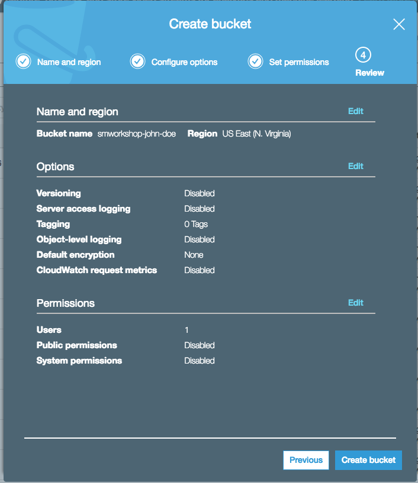

1. Choose **Create Bucket** to complete the S3 bucket creation. You'll use this bucket to host your training data, and also to store the model artifacts.

</p></details>

## 2. Creating Notebook Lifecycle Configuration

Lifecycle configurations are small bootup scripts, that you can use to automate certain tasks when a Notebook instance in being created and/or being started. For this workshop, we'll use a startup script to download pre-built notebooks from this Github repository onto the instances.

If following the low level method for model training and hosting, using this script, we'll also download the files required to make our custom container. In addition, in that case, we'll also use the startup script to start Docker service when the notebook instance is being started.

### High-Level Instructions
1. Create a Lifecycle configuration named `smworkshop-notebook-lifecycle-config` from SageMaker console, with the following script for `Create Notebook`.
    ```
    #!/bin/bash
    set -e
    git clone https://github.com/aws-samples/aws-nlp-workshop.git
    mkdir SageMaker/nlp-workshop
    mv aws-nlp-workshop/3_NLPClassifier/container SageMaker/nlp-workshop/container/
    mv aws-nlp-workshop/3_NLPClassifier/notebooks SageMaker/nlp-workshop/notebooks/
    rm -rf unicornML
    sudo chmod -R ugo+w SageMaker/nlp-workshop/
    sudo yum install -y docker

    ```
1. If you decide to follow the high-level approach for model training and hosting, in the script above, the lines to move `container` folder, and the line to install `docker` are not needed.

1. If you decide to follow low-level approach for model training and hosting, in the same Lifecycle configuration, also add the following script for `Start notebook`.

    ```
    #!/bin/bash
    set -e
    sudo service docker start

    ```
<details>
<summary><strong>Step-by-step instructions (expand for details)</strong></summary><p>

1. In the AWS Management Console choose **Services** then select **Amazon SageMaker** under Machine Learning.

1. Choose **Lifecycle configurations** under the section **Notebook** on the left panel.
    

1. Choose **Create configuration** to open the create dialog.

1. Type the name `smworkshop-notebook-lifecycle-config` in the `Name` field.

1. In the tab **Start notebook**, type or copy-paste the `Start Notebook` script from above. (This is required to run docker service, neccessary only if you are following the low level approach for model training and hosting).
    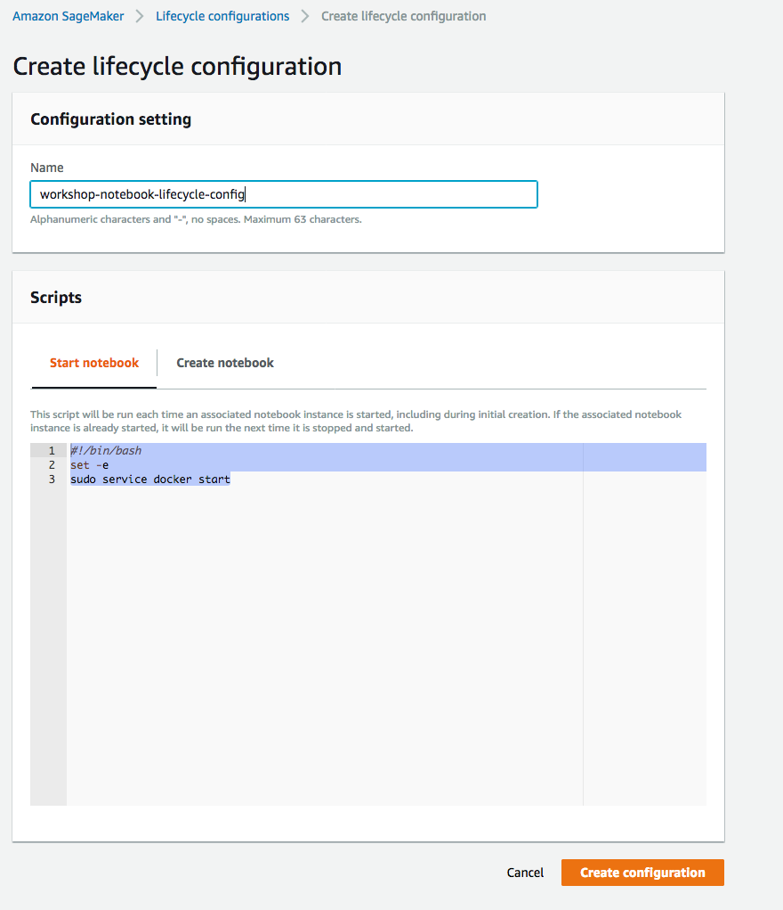

1. In the tab **Create notebook**, type or copy-paste the `Create Notebook` script from above. (You can omit the commands to retain `container` folder and to install `docker`, if you choose to follow the high level approach for model training and hosting).
    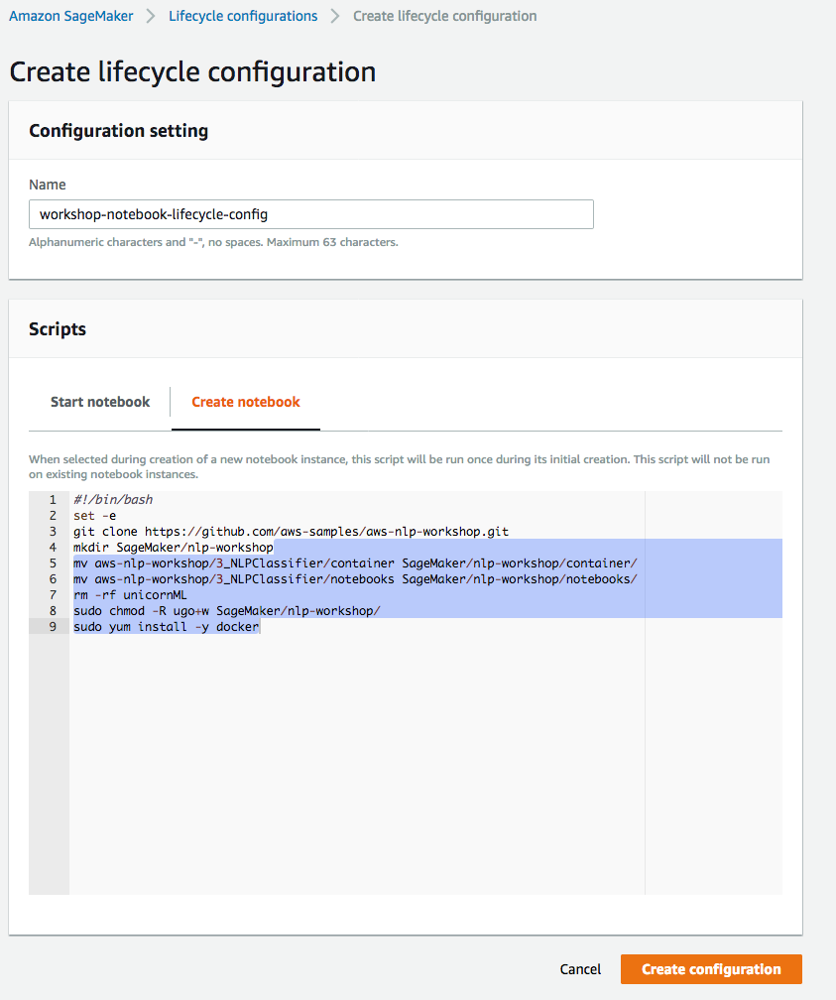

1. Finish configuration by clicking **Create configuration**.

</p></details>

## 3. Launching the Notebook Instance

### High-Level Instructions
From SageMaker console, create a Notebook named `smworkshop-notebook`, with the instance type of `ml.m4.xlarge`.
Create and use an execution role with access to the S3 bucket you created in Section-1.
Use the lifycycle configuration you created in Section-2

<details>
<summary><strong>Step-by-step instructions (expand for details)</strong></summary><p>

1. In the AWS Management Console choose **Services** then select **Amazon SageMaker** under Machine Learning.

1. Choose **Notebook instances** under the section **Notebook** on the left panel.
    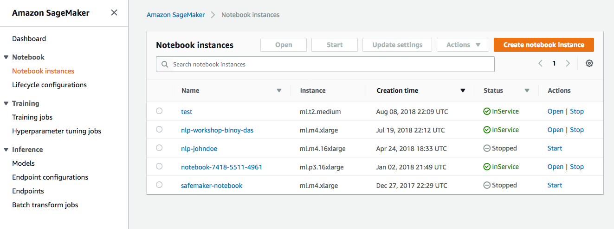

1. Choose **Create notebook Instance** to open the create dialog.

1. Type the name `smworkshop-notebook` in the `Name` field.

1. From `Notebook instance type dropdown`, choose `ml.m4.xlarge`.

1. From `IAM role` dropdown, choose `Create a new role`.

1. In the dialog that pops up, keep the radio button for `Specific S3 buckets` selected, and type the S3 bucket name, that you used in section-1 of this module, such as `smworkshop-firstname-lastname`.
    

1. Choose **Create Role** to return to notebook creation dialog. Notice that SageMaker creates a new execution role with the current timestamp appended at the end of its name, and that this role remains selected under `IAM role` dropdown.

1. From the `Lifecycle configuration` dropdown, choose the configuration named `smworkshop-notebook-lifecycle-config`, that you created in section-2.

1. Leave the VPC selection and Encryption Keys empty for the purpose of this workshop, and choose **Create notebook instance** to finish creation.
    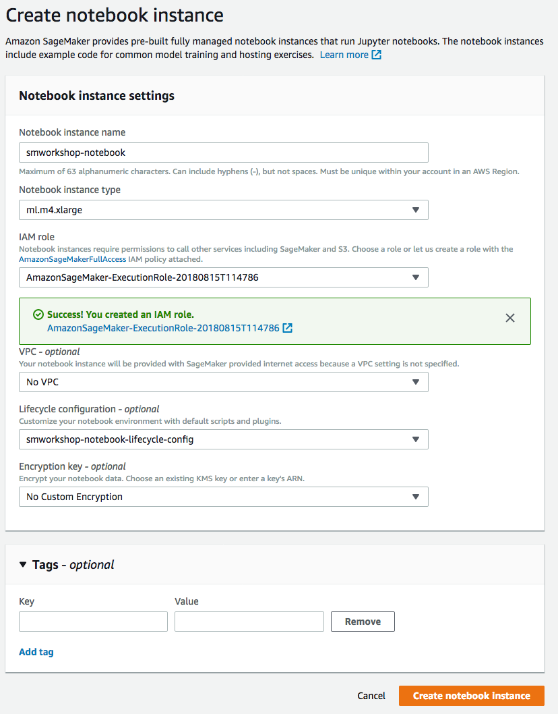

1. You'll be returned to the list of notebooks, with the status of curren notebook shown as `Pending`. Wait till the status changes to `InService`, before proceeding to the next section.
    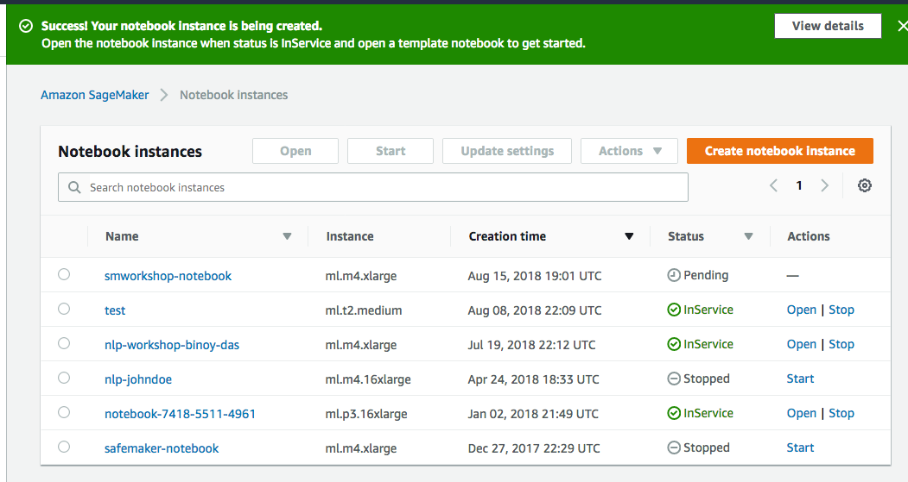

</p></details>

## 4. Granting IAM Policy access to NoteBook Instance
### High-Level Instructions
Since we added access to a specific bucket to the Notebook, it would be conveneient to automatically find the bucket that it has access to from the code running within the notebooks running on the instance. For this purpose, policies granting "Get" access to IAM policies needs to be attached to the execution role.

Following the link to IAM Role, opem the execution role in IAM console, and add actions `iam:GetPolicy` and `iam:GetPolicyVersion` within an inline policy.

<details>
<summary><strong>Step-by-step instructions (expand for details)</strong></summary><p>

1. From the **Notebook instances** page, click on the hyperlink displayed as the `Name` of the notebook you just created, in this case - `smworkshop-notebook`.

1. From the **Notebook instance settings** page, follow the hyperlink displayed as the IAM role ARN.
    

1. From the IAM console page that opens in a new browser tab, displying the role summary, choose **Add Inline policy**
    

1. On **Create policy** page, click on **Choose a service**
    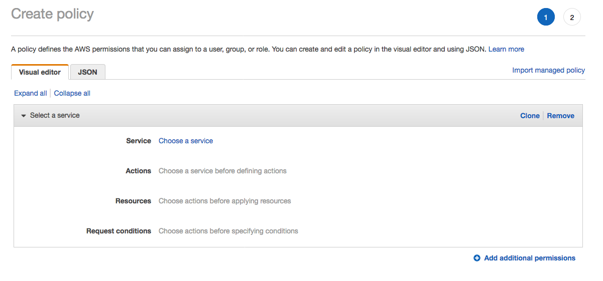

1. In the suggestive search box, type "IAM", to have the list of displayed service filtered down, then choose **IAM** from the narrowed down list.
    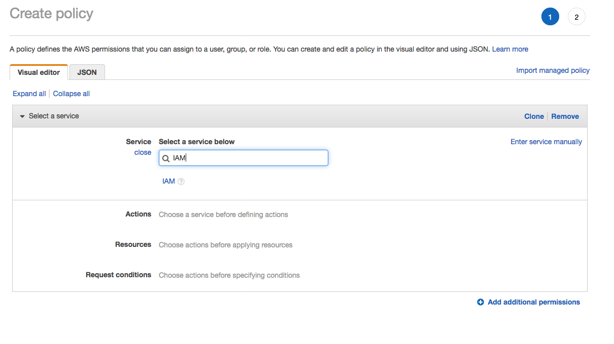

1. Under `Actions` section, expand `Read` Access level

1. Select only actions - **GetPolicy** and **GetPolicyVersion**
    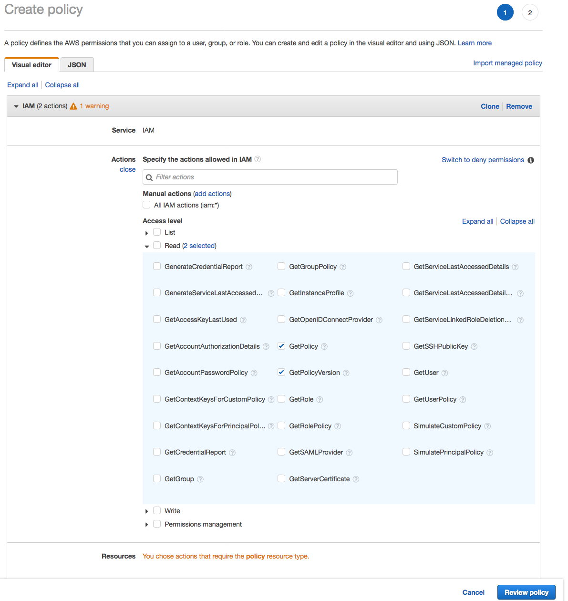

1. Under `Resources` section, click on the text displaying `You chose actions that require the policy resource type`.

1. Choose **All resources** radio button under `Resources` section.
    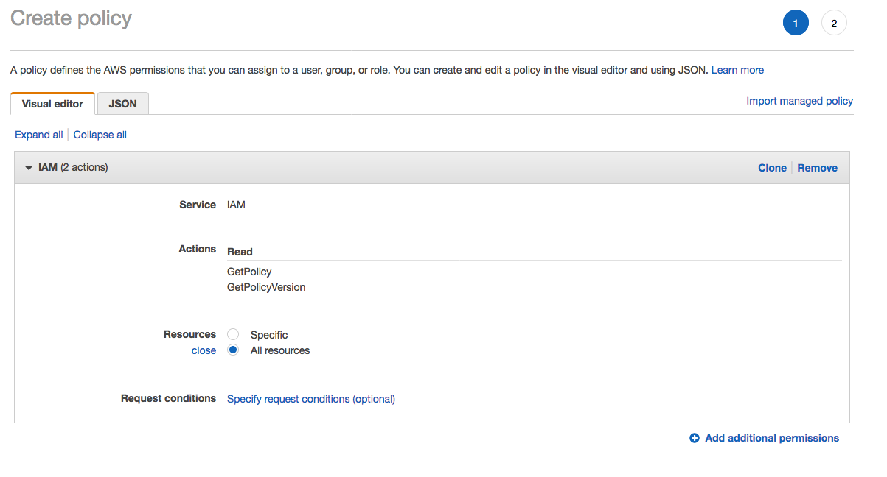

1. Choose **Review policy** at the bootom right-hand corner of the screen.

1. In the review screen, ensure there are no errors or warnings displayed.

1. Type a name of the policy in `Name` field, Choose a meaningful name, such as `IAMRoleRead`.

1. Choose **Create policy** at the bootom right-hand corner of the screen.
    

1. Close the browser tab

</p></details>

## 5. Granting ECR Repository access to NoteBook Instance
### High-Level Instructions
If we follow the low level approach of creating our own conatiner and publishing to an ECR repository, in order to use with a SageMaker hosted training job, we need to add requisite permissions to this Notebook instance. For this purpose, policies granting "Write" access to ECR needs to be attached to the execution role that we created earlier for this Notebook instance.

Following the link to IAM Role, opem the execution role in IAM console, and add actions `ecr:CreateRepository`, `ecr:CompleteLayerUpload`,  `ecr:UploadLayerPart`, `ecr:InitiateLayerUpload`, and `ecr:PutImage` within an inline policy.

<details>
<summary><strong>Step-by-step instructions (expand for details)</strong></summary><p>

1. From the **Notebook instances** page, click on the hyperlink displayed as the `Name` of the notebook you just created, in this case - `smworkshop-notebook`.

1. From the **Notebook instance settings** page, follow the hyperlink displayed as the IAM role ARN.
    

1. From the IAM console page that opens in a new browser tab, displying the role summary, choose **Add Inline policy**
    

1. On **Create policy** page, click on **Choose a service**
    

1. In the suggestive search box, type "EC2", to have the list of displayed service filtered down, then choose **EC2 Container Registry** from the narrowed down list.
    

1. Under `Actions` section, expand `Write` Access level

1. Select actions - **CreateRepository**, **InitiateLayerUpload**, **UploadLayerPart**, **CompleteLayerUpload** and **PutImage**
    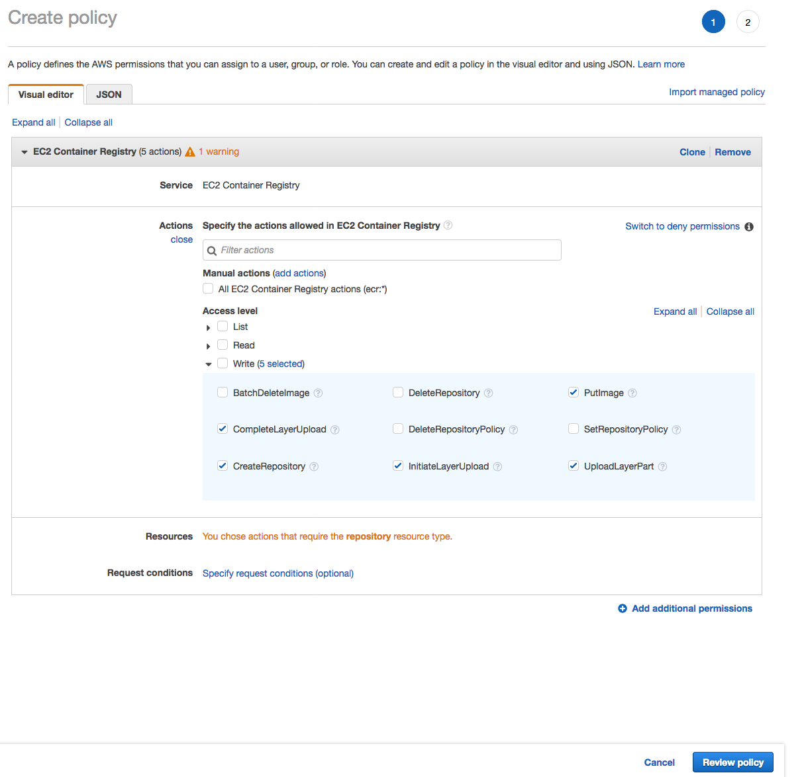

1. Under `Resources` section, click on the text displaying `You chose actions that require the policy resource type`.

1. Choose **All resources** radio button under `Resources` section.
    

1. Choose **Review policy** at the bootom right-hand corner of the screen.

1. In the review screen, ensure there are no errors or warnings displayed.

1. Type a name of the policy in `Name` field, Choose a meaningful name, such as `ECRUpload`.

1. Choose **Create policy** at the bootom right-hand corner of the screen.
    

1. Close the browser tab
</p></details>

## 6. Accessing the Notebook Instance
### High-Level Instructions
Once the Notebook is in service, follow the link to open the hosted Jupyter notebook server. Required files have all been obtained from this Github repository via the Lifecycle configuration script, and ready to be used under the folder - `nlp-workshop`.

<details>
<summary><strong>Step-by-step instructions (expand for details)</strong></summary><p>

1. From the **Notebook instances** page, click on the hyperlink displayed as the `Name` of the notebook you just created, in this case - `smworkshop-notebook`.

1. Wait for the server status to change to **InService**. This will take several minutes, possibly up to ten but likely less.

    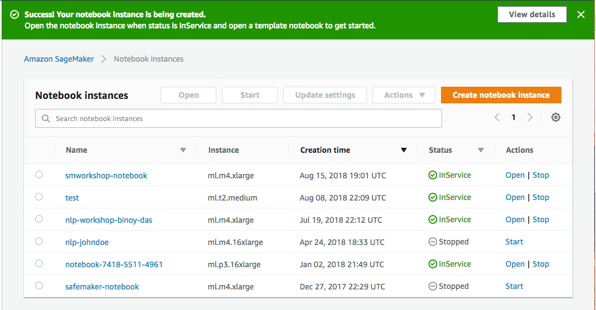

1. Click **Open**. You will now see the Jupyter homepage for your notebook instance.

    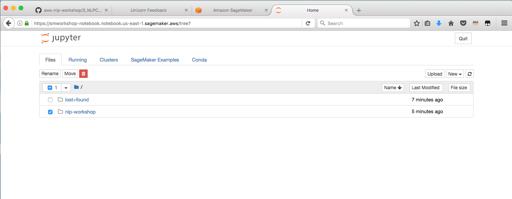

1. The folder named `nlp-workshop` contains the required notebooks and containerization framework neede for the following section. Click on the folder name to navigate into the folder, then follow one of the two approaches from the section to train and host a gender identification model.
</p></details>

## 7. Model Training and Hosting

1. Now, you are going to build a machine learning model on SageMaker. We have created two methods, the first method uses "High Level Sagemaker APIs" which abstracts away some part of the packaging steps.

   The second method called "Low Level API method" which takes you through the lower level APIs, including the steps to create your own docker image to deploy the Keras model.

2. Both methods require a minimum of 30mins to run. Choose one method to proceed.

    <details>
    <summary><strong>High Level Sagemaker API Method (expand for details)</strong></summary><p>

    Once you open the notebook, you will see a file browser. Browse to the folder called "nlp-workshop/notebooks/". Click on the "highlevel-tensorflow-classifer.ipynb" file to open the Jypyter notebook. The remaining instructions to run the notebook are embeddeded in the notebook itself.

    After successfully creating an endpoint, the next step would be to create a new API Gateway method, a Lambda function in the backend to integrate with the hosted endpoint, and update the configuration Javsacript of your webapplication so that when `Identify Gender` button is clicked, this new endpoint recieved the HTTP request. If you're eager to see the end result of all the hard work you put in to identify customers' genders, you can launch one of these AWS CloudFormation templates in the Region of your choice to build the necessary resources automatically.

    Region| Launch
    ------|-----
    US East (N. Virginia) | [](https://console.aws.amazon.com/cloudformation/home?region=us-east-1#/stacks/new?stackName=nlp-workshop-voc-sagemaker&templateURL=https://s3.amazonaws.com/nlp-serverless-workshop/voc-sagemaker-high-level.json)
    US East (Ohio) | [](https://console.aws.amazon.com/cloudformation/home?region=us-east-2#/stacks/new?stackName=nlp-workshop-voc-sagemaker&templateURL=https://s3.amazonaws.com/nlp-serverless-workshop/voc-sagemaker-high-level.json)
    US West (Oregon) | [](https://console.aws.amazon.com/cloudformation/home?region=us-west-2#/stacks/new?stackName=nlp-workshop-voc-sagemaker&templateURL=https://s3.amazonaws.com/nlp-serverless-workshop/voc-sagemaker-high-level.json)
    EU (Ireland) | [](https://console.aws.amazon.com/cloudformation/home?region=eu-west-1#/stacks/new?stackName=nlp-workshop-voc-sagemaker&templateURL=https://s3.amazonaws.com/nlp-serverless-workshop/voc-sagemaker-high-level.json)

    </details>

    <details>
    <summary><strong>Low Level Sagemaker API using Docker - method (expand for details)</strong></summary><p>

    #### 1. Experimentation
            
    In the experimentation phase you'll use the notebook named `dockerizer-preperation-gender-classifier.ipynb` to collect data, format data for your experiment, build and tweak the model and do some quick test to validate the propose model works.

    So head over to that notebook, and come back to the next sub-section once you finish running the notebook - `dockerizer-preperation-gender-classifier.ipynb`

    #### 2. Containerization
            
    In the containerization phase, you'll package the training and prediction code that you perfected during the experimentation phase, and use SageMaker to orchestrate training and hosting, possibly running training for more epochs, to get better accuracy of predictions.

    So, from your notebook instance, open the notebook named `dockerizer-orchestration-gender-classifier.ipynb`, and follow along. Once completed, come back to the next sub-section.

    #### 3. Integration
            
    Now that you have the trained model hosted behind a SageMaker managed endpoint, the next step would be to create a new API Gateway method, a Lambda function in the backend to integrate with the hosted endpoint, and update the configuration Javsacript of your webapplication.
    
    Once configured, this will enable the `Identify Gender` button, which when clicked, would send HTTP request to the new endpoint. 
    
    Eager to see the end result of all the hard work you put in to identify customers' genders?  Launch one of these AWS CloudFormation templates in the Region of your choice to build the necessary resources
    automatically.

    Region| Launch
    ------|-----
    US East (N. Virginia) | [](https://console.aws.amazon.com/cloudformation/home?region=us-east-1#/stacks/new?stackName=nlp-workshop-voc-sagemaker&templateURL=https://s3.amazonaws.com/nlp-workshop/templates/voc-sagemaker.json)
    US East (Ohio) | [](https://console.aws.amazon.com/cloudformation/home?region=us-east-2#/stacks/new?stackName=nlp-workshop-voc-sagemaker&templateURL=https://s3.amazonaws.com/nlp-workshop/templates/voc-sagemaker.json)
    US West (Oregon) | [](https://console.aws.amazon.com/cloudformation/home?region=us-west-2#/stacks/new?stackName=nlp-workshop-voc-sagemaker&templateURL=https://s3.amazonaws.com/nlp-workshop/templates/voc-sagemaker.json)
    EU (Ireland) | [](https://console.aws.amazon.com/cloudformation/home?region=eu-west-1#/stacks/new?stackName=nlp-workshop-voc-sagemaker&templateURL=https://s3.amazonaws.com/nlp-workshop/templates/voc-sagemaker.json)
    </details>


3. Now you will be able to make predictions about the gender of the customer from the first name. Try to see if you can increase the accuracy of your predictions.
