# Module 1: VOC Web Application Framework with Amazon S3

In this module you'll configure Amazon Simple Storage Service (S3) to host the static resources for your web application. In addition you'll also create the serverless framework needed to persist data from the eront-end. These include a DynamoDB table to store customers' feedbacks, an API Gateway deployment with methods to store and retrieve data, and associated Lambda functions to facilitate the integration with serverless backend.

In subsequent modules you'll add AI/ML functionalities to this application, using Amazon Comprehend to analyze users' sentiments, and a hosted endpoint on SageMaker to identify users' gender.

If you're already comfortable hosting webapplication on Amazon S3 and using APi Gateway and Lambda to add data persistence and retrieval capabilities to an web-application via Javascript, or you just want to skip ahead to satrt working with Amazon Comprehend and AWS SageMaker, you can launch one of these AWS CloudFormation templates in the Region of your choice to build the necessary resources automatically.

Region| Launch
------|-----
US East (N. Virginia) | [](https://console.aws.amazon.com/cloudformation/home?region=us-east-1#/stacks/new?stackName=nlp-workshop-voc-webapp&templateURL=https://s3.amazonaws.com/nlp-serverless-workshop/voc-webapp.json)
US East (Ohio) | [](https://console.aws.amazon.com/cloudformation/home?region=us-east-2#/stacks/new?stackName=nlp-workshop-voc-webapp&templateURL=https://s3.amazonaws.com/nlp-serverless-workshop/voc-webapp.json)
US West (Oregon) | [](https://console.aws.amazon.com/cloudformation/home?region=us-west-2#/stacks/new?stackName=nlp-workshop-voc-webapp&templateURL=https://s3.amazonaws.com/nlp-serverless-workshop/voc-webapp.json)
EU (Ireland) | [](https://console.aws.amazon.com/cloudformation/home?region=eu-west-1#/stacks/new?stackName=nlp-workshop-voc-webapp&templateURL=https://s3.amazonaws.com/nlp-serverless-workshop/voc-webapp.json)


<details>
<summary><strong>CloudFormation Launch Instructions (expand for details)</strong></summary><p>

1. Click the **Launch Stack** link above for the region of your choice.

1. Click **Next** on the Select Template page.

1. Provide a globally unique name for the **Website Bucket Name** such as `nlp-yourname` and click **Next**.
    

1. On the Options page, leave all the defaults and click **Next**.

1. On the Review page, check the box to acknowledge that CloudFormation will create IAM resources and click **Create**.
    

    This template uses a custom resource to copy the static website assets from a central S3 bucket into your own dedicated bucket. In order for the custom resource to write to the new bucket in your account, it must create an IAM role it can assume with those permissions.

1. Wait for the `nlp-workshop-voc-webapp` stack to reach a status of `CREATE_COMPLETE`.

1. With the `nlp-workshop-voc-webapp` stack selected, click on the **Outputs** tab and click on the WebsiteURL link.

1. Verify the VOC application home page is loading properly and move on to the next module, [Sentiment Analysis](../2_SentimentAnalysis).

</p></details>

## Architecture Overview

The architecture for this module is very straightforward. All of your static web content including HTML, CSS, JavaScript, images and other files will be stored in Amazon S3. Your end users will then access your site using the public website URL exposed by Amazon S3. You don't need to run any web servers or use other services in order to make your site available.

For the purposes of this module you'll use the Amazon S3 website endpoint URL that we supply. It takes the form `http://{your-bucket-name}.s3-website-{region}.amazonaws.com`. For most real applications you'll want to use a custom domain to host your site. If you're interested in using a your own domain, follow the instructions for [setting up a static website using a custom domain](http://docs.aws.amazon.com/AmazonS3/latest/dev/website-hosting-custom-domain-walkthrough.html) in the Amazon S3 documentation.


In addition, you'll create a DynamoDB table to persist the data that the customers submit using the web-form from the application. This table will be be accessed via two Lambda Functions that you'll implement. Lambda functions are on-demand compute platforms, where you specify the piece of code containing the business logic, and AWS runs it on-demand without you having to create and manage your compute instances.

Finally, you'll use API Gateway to expose the Lambda functions. This API will be publicly accessible from the internet. You'll invoke the methods on this gateway to send and request data from the web-application. It is this integration that turns your statically hosted website into a dynamic web application.

## Implementation Instructions

Each of the following sections provide an implementation overview and detailed, step-by-step instructions. The overview should provide enough context for you to complete the implementation if you're already familiar with the AWS Management Console or you want to explore the services yourself without following a walkthrough.

If you're using the latest version of the Chrome, Firefox, or Safari web browsers the step-by-step instructions won't be visible until you expand the section.

### Region Selection

This workshop can be deployed in any AWS region that supports the following services:

- AWS Lambda
- Amazon API Gateway
- Amazon S3
- Amazon DynamoDB
- Amazon SageMaker

You can refer to the [region table](https://aws.amazon.com/about-aws/global-infrastructure/regional-product-services/) in the AWS documentation to see which regions have the supported services. Among the supported regions you can choose are N. Virginia, Ohio, Oregon, and Ireland.

Once you've chosen a region, you should deploy all of the resources for this workshop there. Make sure you select your region from the dropdown in the upper right corner of the AWS Console before getting started.


### 1. Create an S3 Bucket

Amazon S3 can be used to host static websites without having to configure or manage any web servers. In this step you'll create a new S3 bucket that will be used to host all of the static assets (e.g. HTML, CSS, JavaScript, and image files) for your web application.

#### High-Level Instructions

Use the console or AWS CLI to create an Amazon S3 bucket. Keep in mind that your bucket's name must be globally unique across all regions and customers. We recommend using a name like `nlp-firstname-lastname`. If you get an error that your bucket name already exists, try adding additional numbers or characters until you find an unused name.

<details>
<summary><strong>Step-by-step instructions (expand for details)</strong></summary><p>

1. In the AWS Management Console choose **Services** then select **S3** under Storage.

1. Choose **+Create Bucket**

1. Provide a globally unique name for your bucket such as `nlp-firstname-lastname`.

1. Select the Region you've chosen to use for this workshop from the dropdown.

1. Choose **Create** in the lower left of the dialog without selecting a bucket to copy settings from.

    

</p></details>

### 2. Upload Content

Upload the website assets for this module to your S3 bucket. You can use the AWS Management Console (requires Google Chrome browser), AWS CLI, or the provided CloudFormation template to complete this step. If you already have the AWS CLI installed and configured on your local machine, we recommend using that method. Otherwise, use the console if you have the latest version of Google Chrome installed.

<details>
<summary><strong>CLI step-by-step instructions (expand for details)</strong></summary><p>

If you already have the CLI installed and configured, you can use it to copy the necessary web assets from `s3://nlp-workshop/website-source` to your bucket.

Execute the following command making sure to replace `YOUR_BUCKET_NAME` with the name you used in the previous section and `YOUR_BUKET_REGION` with the region code (e.g. us-east-2) where you created your bucket.

    aws s3 sync s3://nlp-workshop/website-source s3://YOUR_BUCKET_NAME --region YOUR_BUCKET_REGION

If the command was successful, you should see a list of objects that were copied to your bucket.
</p></details>

<details>
<summary><strong>CloudFormation step-by-step instructions (expand for details)</strong></summary><p>

If you are unable to use either of the previous methods you can launch the provided CloudFormation template in order to copy the necessary assets into your S3 bucket.

Region| Launch
------|-----
US East (N. Virginia) | [](https://console.aws.amazon.com/cloudformation/home?region=us-east-1#/stacks/new?stackName=nlp-copy-objects&templateURL=https://s3.amazonaws.com/nlp-workshop/templates/webapp-copy-objects.json)
US East (Ohio) | [](https://console.aws.amazon.com/cloudformation/home?region=us-east-2#/stacks/new?stackName=nlp-copy-objects&templateURL=https://s3.amazonaws.com/nlp-workshop/templates/webapp-copy-objects.json)
US West (Oregon) | [](https://console.aws.amazon.com/cloudformation/home?region=us-west-2#/stacks/new?stackName=nlp-copy-objects&templateURL=https://s3.amazonaws.com/nlp-workshop/templates/webapp-copy-objects.json)
EU (Ireland) | [](https://console.aws.amazon.com/cloudformation/home?region=eu-west-1#/stacks/new?stackName=nlp-copy-objects&templateURL=https://s3.amazonaws.com/nlp-workshop/templates/webapp-copy-objects.json)


1. Click the **Launch Stack** link above for the region where you created your website bucket.

1. Click **Next** on the Select Template page.

1. Enter the name of your S3 bucket (e.g. `nlp-yourname`) for **Website Bucket Name** and click **Next**.

1. On the Options page, leave all the defaults and click **Next**.

1. On the Review page, check the box to acknowledge that CloudFormation will create IAM resources and click **Create**.
    

    This template uses a custom resource to copy the static website assets from a central S3 bucket into your own dedicated bucket. In order for the custom resource to write to the new bucket in your account, it must create an IAM role it can assume with those permissions.

1. Wait for the `nlp-copy-objects` stack to reach a status of `CREATE_COMPLETE`.

</p></details>

### 3. Add a Bucket Policy to Allow Public Reads

You can define who can access the content in your S3 buckets using a bucket policy. Bucket policies are JSON documents that specify what principals are allowed to execute various actions against the objects in your bucket.

#### High-Level Instructions

You will need to add a bucket policy to your new Amazon S3 bucket to let anonymous users view your site. By default your bucket will only be accessible by authenticated users with access to your AWS account.

See [this example](http://docs.aws.amazon.com/AmazonS3/latest/dev/example-bucket-policies.html#example-bucket-policies-use-case-2) of a policy that will grant read only access to anonymous users. This example policy allows anyone on the Internet to view your content. The easiest way to update a bucket policy is to use the console. Select the bucket, choose the permission tab and then select Bucket Policy.

<details>
<summary><strong>Step-by-step instructions (expand for details)</strong></summary><p>

1. In the S3 console, select the name of the bucket you created in section 1.

1. Choose the **Permissions** tab, then choose **Bucket Policy**.

1. Enter the following policy document into the bucket policy editor replacing `YOUR_BUCKET_NAME` with the name of the bucket you created in section 1:

    ```json
    {
        "Version": "2012-10-17",
        "Statement": [
            {
                "Effect": "Allow",
                "Principal": "*",
                "Action": "s3:GetObject",
                "Resource": "arn:aws:s3:::YOUR_BUCKET_NAME/*"
            }
        ]
    }
    ```

    

1. Choose **Save** to apply the new policy.

</p></details>

### 4. Enable Website Hosting

By default objects in an S3 bucket are available via URLs with the structure http://<Regional-S3-prefix>.amazonaws.com/<bucket-name>/<object-key>. In order to serve assets from the root URL (e.g. /unicornfeedback.html), you'll need to enable website hosting on the bucket. This will make your objects available at the AWS Region-specific website endpoint of the bucket: <bucket-name>.s3-website-<AWS-region>.amazonaws.com

You can also use a custom domain for your website. Setting up a custom domain is not covered in this workshop, but you can find detailed instructions in our [documentation](http://docs.aws.amazon.com/AmazonS3/latest/dev/website-hosting-custom-domain-walkthrough.html).

#### High-Level Instructions

Using the console, enable static website hosting. You can do this on the Properties tab after you've selected the bucket. Set `unicornfeedback.html` as the index document, and leave the error document blank. See the documentation on [configuring a bucket for static website hosting](https://docs.aws.amazon.com/AmazonS3/latest/dev/HowDoIWebsiteConfiguration.html) for more details.

<details>
<summary><strong>Step-by-step instructions (expand for details)</strong></summary><p>

1. From the bucket detail page in the S3 console, choose the **Properties** tab.

1. Choose the **Static website hosting** card.

1. Select **Use this bucket to host a website** and enter `unicornfeedback.html` for the Index document. Leave the other fields blank.

1. Note the **Endpoint** URL at the top of the dialog before choosing **Save**. You will use this URL throughout the rest of the workshop to view your web application. From here on this URL will be referred to as your website's base URL.

1. Click **Save** to save your changes.

    

</p></details>

### Implementation Validation

After completing these implementation steps you should be able to access your static website by visiting the the website endpoint URL for your S3 bucket.

<details>
<summary><strong>Step-by-step instructions (expand for details)</strong></summary><p>
Visit your website's base URL (this is the URL you noted in section 4) in the browser of your choice. You should see the Voice of the Customer Application home page displayed. If you need to lookup the base URL, visit the S3 console, select your bucket and then click the **Static Web Hosting** card on the **Properties** tab.

If the page renders correctly (see below for an example screenshot), you should see an empty table containing four columns - Name, feedback, Sentiment and Gender.

Since you haven't added any database to persist any customer feedback, the table will remain empty, until you add the DynamoDB table and the API Gateway methods alongwith Lambda functions to save and read data from the table.

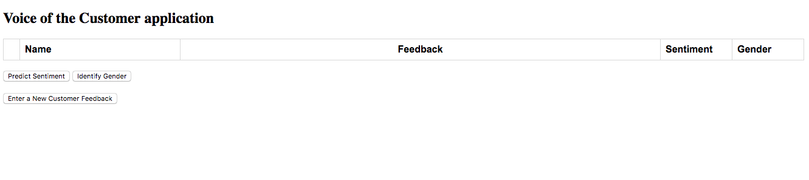
</p></details>

### 5. Create an Amazon DynamoDB Table

Use the Amazon DynamoDB console to create a new DynamoDB table. Call your table `UnicornCustomerFeedback` and give it a partition key called `ID` and a sort key called `PostedTime`, both with type String. The table name, partition key, and sort keys are case sensitive. Make sure you use the exact IDs provided. Use the defaults for all other settings.

After you've created the table, note the ARN for use in the next step.

<details>
<summary><strong>Step-by-step instructions (expand for details)</strong></summary><p>

1. From the AWS Management Console, choose **Services** then select **DynamoDB** under Databases.

1. Choose **Create table**.

1. Enter `UnicornCustomerFeedback` for the **Table name**. This field is case sensitive.

1. Enter `ID` for the **Partition key** and select **String** for the key type. This field is case sensitive.

1. Check the **Add sort key** box.

1. Enter `PostedTime` for the sort key and select **String** for the key type. This field is case sensitive.

1. Check the **Use default settings** box and choose **Create**.

    

1. Scroll to the bottom of the Overview section of your new table and note the **ARN**. You will use this in the next section.

</p></details>

### 6. Create an IAM Role for Your Lambda function

#### Background

Every Lambda function has an IAM role associated with it. This role defines what other AWS services the function is allowed to interact with. For the purposes of this workshop, you'll need to create an IAM role that grants your Lambda function permission to write logs to Amazon CloudWatch Logs, access to write items to your DynamoDB table, and permission to read and write objects from S3 bucket.

#### High-Level Instructions

Use the IAM console to create a new role. Name it `VOCLambdaRole` and select AWS Lambda for the role type. You'll need to attach policies that grant your function permissions to write to Amazon CloudWatch Logs and put items to DynamoDB table and S3 bucket.

Create a custom inline policy for your role that allows all `dynamodb:*`, `s3:*`, and `logs:*` actions.

<details>
<summary><strong>Step-by-step instructions (expand for details)</strong></summary><p>

1. From the AWS Management Console, click on **Services** and then select **IAM** in the Security, Identity & Compliance section.

1. Select **Roles** in the left navigation bar and then choose **Create role**.

1. From the **AWS service** group, under the section **Choose the service that will use this role**, select **Lambda** 

1. **Lambda** appears under the section **Select your use case**. Select the sole use case **Lambda**, as this allows lambda functions to call AWS services on your behalf. Then click **Next: Permissions**

    **Note:** Selecting a role type automatically creates a trust policy for your role that allows AWS services to assume this role on your behalf. If you were creating this role using the CLI, AWS CloudFormation or another mechanism, you would specify a trust policy directly.

1. Begin typing `AWSLambdaBasicExecutionRole` in the **Filter** text box and check the box next to that role.

1. Click **Next: Review**.

1. Enter `VOCLambdaRole` for the **Role name**.

1. Choose **Create role**.

1. Type `VOCLambdaRole` into the filter box on the Roles page and choose the role you just created.

1. On the Permissions tab, choose the **Add inline policy** link in the lower right corner to create a new inline policy.
    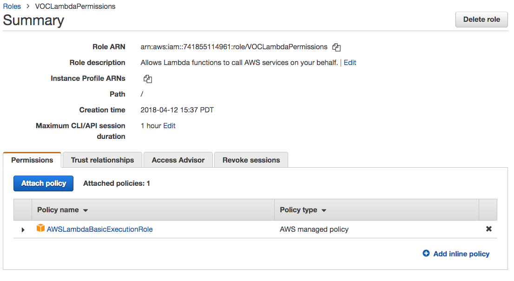

1. Select **JSON** tab.

1. Enter the following policy document into the policy editor :
    ```json
    {
        "Version": "2012-10-17",
        "Statement": [
            {
                "Action": [
                    "dynamodb:BatchGetItem",
                    "dynamodb:DescribeTable",
                    "dynamodb:GetItem",
                    "dynamodb:PutItem",
                    "dynamodb:UpdateItem",
                    "dynamodb:DeleteItem",
                    "dynamodb:ListTables",
                    "dynamodb:Query",
                    "dynamodb:Scan",
                    "dynamodb:DescribeStream",
                    "dynamodb:GetRecords",
                    "dynamodb:GetShardIterator",
                    "dynamodb:ListStreams",
                    "comprehend:DetectSentiment",
                    "sagemaker:InvokeEndpoint",
                    "s3:ListBucket",
                    "s3:GetObject",
                    "s3:PutObject",
                    "s3:PutObjectAcl",
                    "s3:PutObjectVersionAcl",
                    "s3:DeleteObject",
                    "s3:DeleteObjectVersion",
                    "s3:CopyObject",
                    "xray:PutTraceSegments"
                ],
                "Resource": "*",
                "Effect": "Allow"
            }
        ]
    }
    ```

    

1. Choose **Review Policy**.

1. Make sure appropriate permissions for the services as listed above, are shown in the review screen.

1. Enter `VOCLAmbdaAllAccess` for the policy name and choose **Create policy**.
    

</p></details>

### 7. Create a Lambda Function for Writing Feedbacks into DynamoDB

#### Background

AWS Lambda will run your code in response to events such as an HTTP request. In this step and the next you'll build the core functions that will process API requests from the web application to submit a feedback and list all submitted feedbacks. In the next step you'll use Amazon API Gateway to create a RESTful API that will expose an HTTP endpoint that can be invoked from your users' browsers. You'll then connect the Lambda functions you create in this step and the next to that API in order to create a fully functional backend for your web application.

#### High-Level Instructions

Use the AWS Lambda console to create a new Lambda function called `EnterCustomerFeedback` that will process the API request submitted with customer name and feedback. Use the provided [entercustomerfeedback.py](functions/entercustomerfeedback.py) example implementation for your function code. Just copy and paste from that file into the AWS Lambda console's editor.

Make sure you pass the name of the DynamoDB table that you created earlier to your Lambda function, through an environment variable named `table_name` and you configure your function to use the `VOCLambdaRole` IAM role you created in the previous section.

<details>
<summary><strong>Step-by-step instructions (expand for details)</strong></summary><p>

1. Choose on **Services** then select **Lambda** in the Compute section.

1. Click **Create function**.

1. Keep the default **Author from scratch** card selected.

1. Enter `EnterCustomerFeedback` in the **Name** field.

1. Select **Python 3.6** for the **Runtime**.

1. Ensure `Choose an existing role` is selected from the **Role** dropdown.

1. Select `VOCLambdaRole` from the **Existing Role** dropdown.
    

1. Click on **Create function**.

1. Scroll down to the **Function code** section and replace the existing code in the **lambda_function.py** code editor with the contents of [entercustomerfeedback.py](functions/entercustomerfeedback.py).
    

1. Scroll down to the **Environment variables** section and add one environment variable. Environment variables are key vaue pairs, entered one in each pair of boxes. The box to the left contains the variable name, and the box to the right contains value. In this function, you create one variable by entering `table_name` as name and `UnicorCustomerFeedback` as value. Make sure this value is same as the name of the DynamoDB table you used.
    

1. Click **"Save"** in the upper right corner of the page.

</p></details>

### 8. Create a Lambda Function for Retrieving Feedbacks from DynamoDB

#### Background

You'll follow the same staeps as above to create a Lambda function that will read all the records in DynamoDB table and return the list. AWS Lambda will run your code in response to events such as an HTTP request. 

#### High-Level Instructions

Use the AWS Lambda console to create a new Lambda function called `GetAllCustomerFeedbacks` that will process the API request submitted with customer name and feedback. Use the provided [getallcustomerfeedbacks.py](functions/getallcustomerfeedbacks.py) example implementation for your function code. Just copy and paste from that file into the AWS Lambda console's editor.

Make sure you pass the name of the DynamoDB table that you created earlier to your Lambda function, through an environment variable named `table_name` and you configure your function to use the `VOCLambdaRole` IAM role you created in the previous section.

<details>
<summary><strong>Step-by-step instructions (expand for details)</strong></summary><p>

1. Choose on **Services** then select **Lambda** in the Compute section.

1. Click **Create function**.

1. Keep the default **Author from scratch** card selected.

1. Enter `EnterCustomerFeedback` in the **Name** field.

1. Select **Python 3.6** for the **Runtime**.

1. Ensure `Choose an existing role` is selected from the **Role** dropdown.

1. Select `VOCLambdaRole` from the **Existing Role** dropdown.
    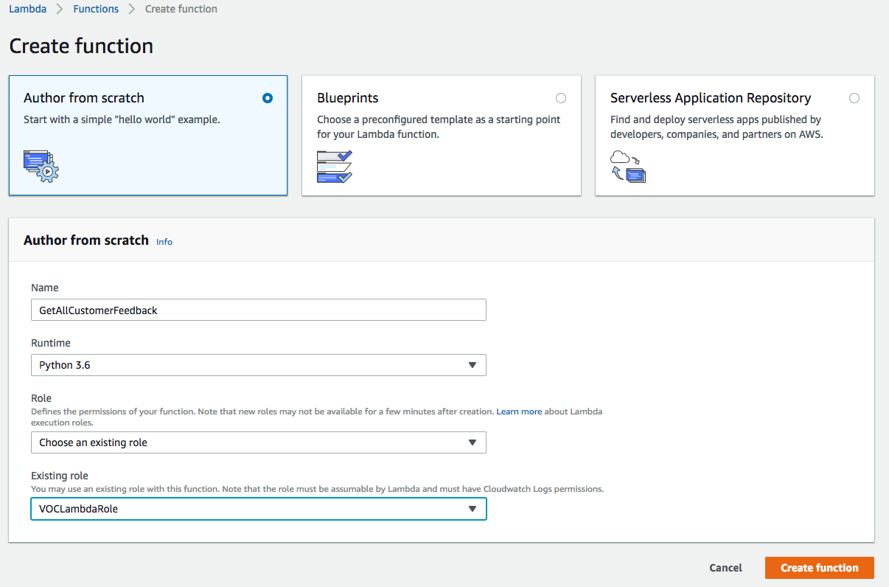

1. Click on **Create function**.

1. Scroll down to the **Function code** section and replace the existing code in the **lambda_function.py** code editor with the contents of [getallcustomerfeedbacks.py](functions/getallcustomerfeedbacks.py).
    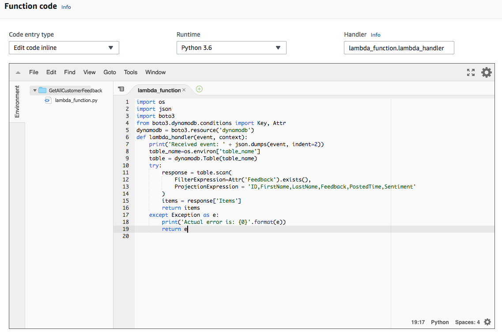

1. Scroll down to the **Environment variables** section and add one environment variable. Environment variables are key vaue pairs, entered one in each pair of boxes. The box to the left contains the variable name, and the box to the right contains value. In this function, you create one variable by entering `table_name` as name and `UnicorCustomerFeedback` as value. Make sure this value is same as the name of the DynamoDB table you used.
    

1. Click **"Save"** in the upper right corner of the page.

</p></details>

### Implementation Validation

In this step you'll test the two functions that you built using the AWS Lambda console. In the next steps you will add a REST API with API Gateway so you can invoke your function from the browser-based application that you have deployed previously.

<details>
<summary><strong>Step-by-step instructions (expand for details)</strong></summary><p>

1. From the main edit screen for `EnterCustomerFeedback` function, select **Configure test event** from the **Select a test event...** dropdown.

1. Keep **Create new test event** selected.

1. Enter `submitfeedback` in the **Event name** field

1. Copy and paste the following test event into the editor:

    ```JSON
    {
        "FirstName": "John",
        "LastName": "Doe",
        "Feedback": "I loved the Unicorns"
    }
    ```

    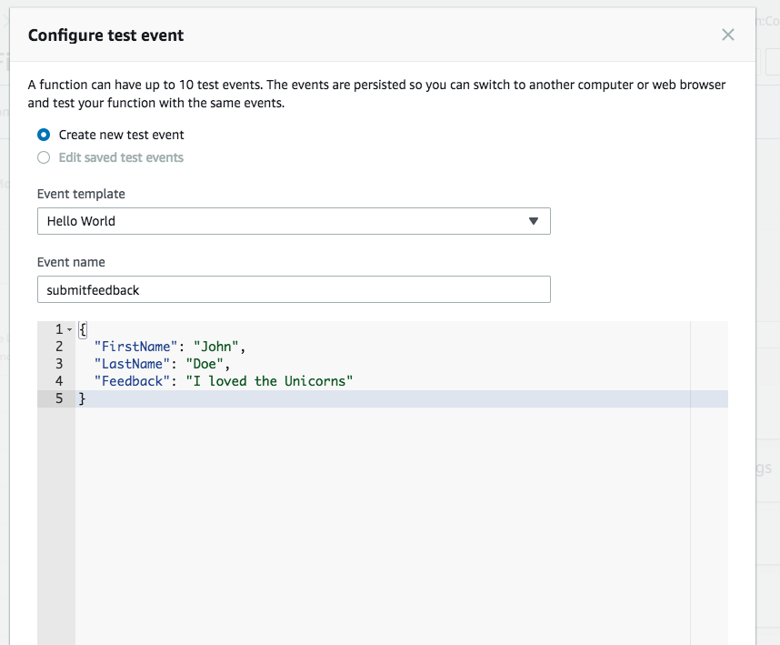

1. Click **Create**.

1. On the main function edit screen click **Test** with `submitfeedback` selected in the dropdown.   

1. Scroll to the top of the page and expand the **Details** section of the **Execution result** section.

1. Verify that the execution succeeded and that the function returns a status code of `200`. The Log output should also show something similar to the following:
   

1. After you have successfully tested your `EnterCustomerFeedback` function, it will enter the record, as shown above, into the DynamoDB table. At this point, if you wish, you can check your DynamoDB table to confirm that the item you just passed to the test event exists in the table.

1. Follwing test event would validate not only that the item was inserted into the table, but also that it can be read by a Lambda function and returned to the caller.

. From the main edit screen for `GetAllCustomerFeedbacks` function, select **Configure test event** from the **Select a test event...** dropdown.

1. Keep **Create new test event** selected.

1. Enter `listfeedbacks` in the **Event name** field

1. Copy and paste the following empty json into the editor (note that we don't need to pass any id because this function fetches all records from database):

    ```JSON
    {

    }
    ```

    

1. Click **Create**.

1. On the main function edit screen click **Test** with `listfeedbacks` selected in the dropdown.   

1. Scroll to the top of the page and expand the **Details** section of the **Execution result** section.

1. Verify that the execution succeeded and that the function returns the record you inserted in the previous test event:

    ```JSON
    [
        {
            "Feedback": "I loved the Unicorns",
            "FirstName": "John",
            "ID": "c093b3a6-14b0-4b80-b204-b732fcc10d0d",
            "LastName": "Doe",
            "PostedTime": "2018-04-13T00:05:37.923174"
        }
    ]
    ```
   
</p></details>

### 9. Create a New REST API
Use the Amazon API Gateway console to create a new API. This API will be accessible on the public internet and will expose the Lambda functions you built in the previous two steps. Using this API, you will turn your statically hosted website into a dynamic web application by adding client-side Javascript that makes AJAX calls to the exposed APIs.

The static website you deployed already has a configration javascript that you'll modify to add the endpoint once you finished deploying this API. Once done, rest of the controls in the applciation will start sending requests to your API endpoint methods.

<details>
<summary><strong>Step-by-step instructions (expand for details)</strong></summary><p>

1. In the AWS Management Console, click **Services** then select **API Gateway** under Application Services.

1. Choose **Create API**.

1. Select **New API** and enter `NLP Workshop API` for the **API Name**.

1. Select `Edge optimized` from the **Endpoint Type** dropdown.
    ***Note***: Edge optimized are best for public services being accessed from the Internet. Regional endpoints are typically used for APIs that are accessed primarily from within the same AWS Region.

1. Choose **Create API**

    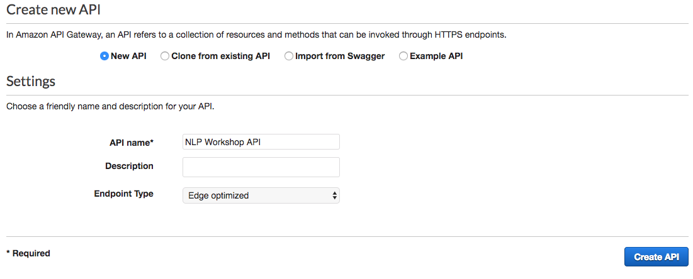

</p></details>

### 10. Create a new resource and method
Create a new resource called /ride within your API. Then create a POST method for that resource and configure it to use a Lambda proxy integration backed by the RequestUnicorn function you created in the first step of this module.

<details>
<summary><strong>Step-by-step instructions (expand for details)</strong></summary><p>

1. In the left nav, click on **Resources** under your NLP Workshop API.

1. From the **Actions** dropdown select **Create Resource**.

1. Enter `enterfeedback` as the **Resource Name**.

1. Ensure the **Resource Path** is set to `enterfeedback`.

1. Select **Enable API Gateway CORS** for the resource.

1. Click **Create Resource**.

    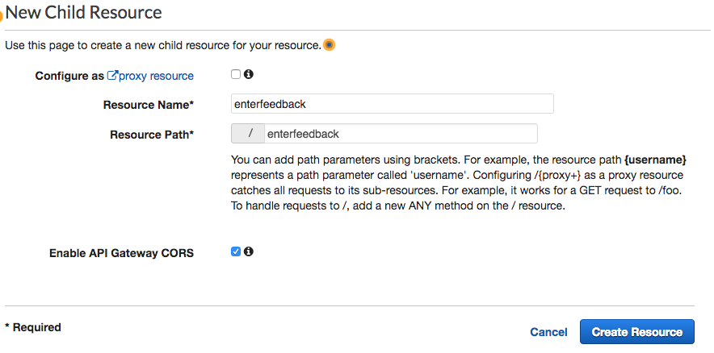

1. With the newly created `/enterfeedback` resource selected, from the **Action** dropdown select **Create Method**.

1. Select `GET` from the new dropdown that appears, then **click the checkmark**.

    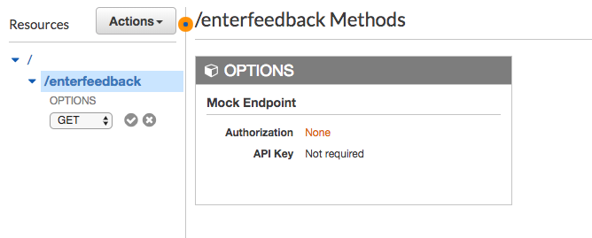

1. Select **Lambda Function** for the integration type.

1. Select the Region you are using for **Lambda Region**.

1. Enter the name of the function you created in the previous module, `EnterCustomerFeedback`, for **Lambda Function**.

1. Choose **Save**. Please note, if you get an error that you function does not exist, check that the region you selected matches the one you used in the beginning of this section.

    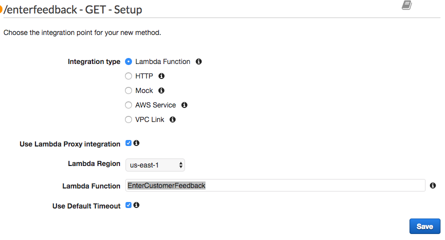

1. When prompted to give Amazon API Gateway permission to invoke your function, choose **OK**.

1. Choose the **Method Request** card.

1. Expand the section named **URL Query String Parameters**.

1. Select the **Add query string**.

1. Enter parameter **Name** as `FirstName`, then **click the checkmark**.

1. Select the **Required** checkbox next to `FirstName`

1. Select the **Add query string**.

1. Enter parameter **Name** as `LastName`, then **click the checkmark**.

1. Select the **Required** checkbox next to `LastName`

1. Select the **Add query string**.

1. Enter parameter **Name** as `Feedback`, then **click the checkmark**.

    

1. Click on the **<-Method Execution** link to go back to `GET` method's configuration page

1. Choose the **Integration Request** card.

1. Expand the section named **Body Mapping Templates**

1. From **Request body passthrouhg** choose the option **When there are no templates defined (recommended)**

    

1. Click on the **<-Method Execution** link to go back to `GET` method's configuration page

1. Choose the **Method Response** card.

1. Click **Add Header** under **Response Headers for 200**.

1. Enter the value `Access-Control-Allow-Origin` as header **Name**, then **click the checkmark**.

1. Click on the **<-Method Execution** link to go back to `GET` method's configuration page

    

1. Select the root(`/`) method of the API

1. From the **Actions** dropdown select **Create Resource**.

1. Enter `getallcontents` as the **Resource Name**.

1. Ensure the **Resource Path** is set to `getallcontents`.

1. Select **Enable API Gateway CORS** for the resource.

1. Click **Create Resource**.

    

1. With the newly created `/getallcontents` resource selected, from the **Action** dropdown select **Create Method**.

1. Select `GET` from the new dropdown that appears, then **click the checkmark**.

    

1. Select **Lambda Function** for the integration type.

1. Select the Region you are using for **Lambda Region**.

1. Enter the name of the function you created in the previous module, `GetAllCustomerFeedbacks`, for **Lambda Function**.

1. Choose **Save**. Please note, if you get an error that you function does not exist, check that the region you selected matches the one you used in the beginning of this section.

    

1. When prompted to give Amazon API Gateway permission to invoke your function, choose **OK**.

1. Click on the **<-Method Execution** link to go back to `GET` method's configuration page

1. Choose the **Integration Request** card.

1. Expand the section named **Body Mapping Templates**

1. From **Request body passthrouhg** choose the option **When there are no templates defined (recommended)**

    

1. Click on the **<-Method Execution** link to go back to `GET` method's configuration page

1. Choose the **Method Response** card.

1. Click **Add Header** under **Response Headers for 200**.

1. Enter the value `Access-Control-Allow-Origin` as header **Name**, then **click the checkmark**.

1. Click on the **<-Method Execution** link to go back to `GET` method's configuration page

    

</p></details>

### Implementation Validation

In this step you'll test the two resources that you created in your API, exposing the Lambda functions built in the previous step. This test will validate that that parameters from `GET` requests are passed to Lambda function as event parameters and that the API Gateway has the appropriate permission needed to invoke the Lambda functions and return the function response as HTTP response. In the next steps you will deploy the REST API and update the client side Javascript, so that your web application can invoke these methods and populate the web page.

<details>
<summary><strong>Step-by-step instructions (expand for details)</strong></summary><p>

1. From the **Resources** section of `NLP Workshop API` function, select the `GET` method under the resource `enterfeedback`.

1. Click on the link for  **TEST** under the **Client** card.

1. Since you have previously selected `FirstName`, `LastName`, and `Feedback` as query string paramters for **Method Request**, you'll be presented with an input form with these 3 fields.

1. Enter some sample values, and click the **Test** button.

1. On the right hand side of the test screen, you should see value `200` coming back as response body. This indicates that the API gateway have been able to successfully invoke the Lambda function.

    

1. After you have successfully tested your `enterfeedback` resource, it will enter the record into the DynamoDB table. At this point, if you wish, you can check your DynamoDB table to confirm that the item you just passed to the test event exists in the table.

1. Follwing test event would validate not only that the item was inserted into the table, but also that it can be read by a Lambda function and returned via the API gateway.

1. From the **Resources** section of `NLP Workshop API` function, select the `GET` method under the resource `getallcontents`.

1. Click on the link for  **TEST** under the **Client** card.

1. Since this method does not need any query parameters, simply click the **Test** button.

1. On the right hand side of the test screen, you should see request status to be `200` . This indicates that the API gateway have been able to successfully invoke the Lambda function.

1. Verify that the response body contains both feedback records one inserted during this validation and another inserted during Lambda function validation:

    ```JSON
    [
        {
            "Feedback": "I loved the Unicorns",
            "FirstName": "John",
            "ID": "c093b3a6-14b0-4b80-b204-b732fcc10d0d",
            "LastName": "Doe",
            "PostedTime": "2018-04-13T00:05:37.923174"
        },
        {
            "Feedback": "Unicorning is not for me.",
            "FirstName": "Jane",
            "ID": "2b86b34f-1b34-4858-8c9e-2608f454a7d7",
            "LastName": "Roe",
            "PostedTime": "2018-04-13T07:01:08.494610"
        }
    ]
    ```

    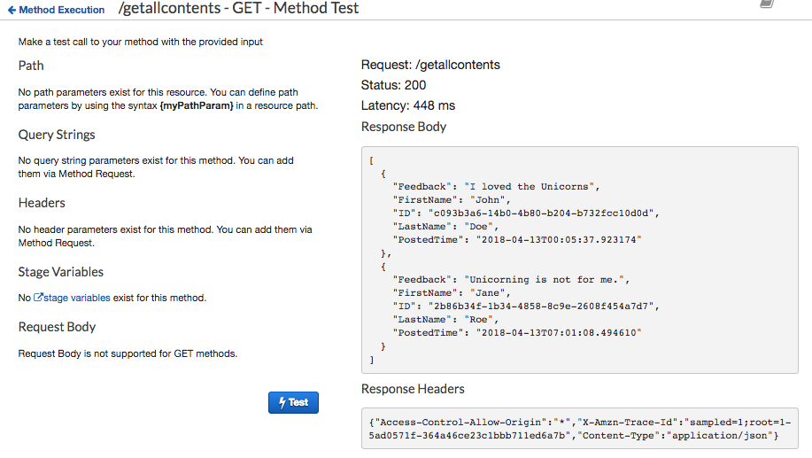
</p></details>

### 11. Deploy Your API
From the Amazon API Gateway console, choose Actions, Deploy API. You'll be prompted to create a new stage. You can use prod for the stage name.

<details>
<summary><strong>Step-by-step instructions (expand for details)</strong></summary><p>

1. In the **Actions** drop-down list select **Deploy API**.

1. Select **[New Stage]** in the **Deployment stage** drop-down list.

1. Enter `vocweb` for the **Stage Name**.

1. Choose **Deploy**.

1. Note the **Invoke URL**. You will use it in the next section.

</p></details>

### 12. Update the Website Config
Update the /js/config.js file in your website deployment to include the invoke URL of the stage you just created. You should copy the invoke URL directly from the top of the stage editor page on the Amazon API Gateway console and paste it into the \_config.api.invokeUrl key of your sites /js/config.js file. 

<details>
<summary><strong>Step-by-step instructions (expand for details)</strong></summary><p>

If you completed this module manually, you can download the `config.js` file from your hosting S3 bucket and save it locally. To do so, visit `/js/config.js` under the base URL for your website and choose **File**, then choose **Save Page As** from your browser.
Note:  
    **Note:** If you used the AWS CloudFormation template, the template created a custome resource and implemented a Lambda function that replace the API endpoint into the config file on your hosting S3 bucket.

1. Open the config.js file in a text editor.

1. Update the **invokeUrl** setting under the **api** key in the config.js file. Set the value to the **Invoke URL** for the deployment stage your created in the previous section.

    An example of a complete `config.js` file is included below. Note, the actual values in your file will be different.

    ```JavaScript
    var _config = {
        api: {
            invokeUrl: https://nx5or4mpue.execute-api.us-east-1.amazonaws.com/vocweb
        }
    };
    ```

1. Save your changes locally.

1. In the AWS Management Console, choose **Services** then select **S3** under Storage.

1. Choose your website bucket and then browse to the `js` key prefix.

1. Choose **Upload**.

1. Choose **Add files**, select the local copy of `config.js` and then click **Next**.

1. Choose **Next** without changing any defaults through the `Set permissions` and `Set properties` sections.

1. Choose **Upload** on the `Review` section.

</p></details>

## Implementation Validation

**Note:** It's possible that you will see a delay between updating the config.js file in your S3 bucket and when the updated content is visible in your browser. You should also ensure that you clear your browser cache before executing the following steps.

1. Visit `/unicornfeedback.html` under your website domain.

1. When the Voice of the Customer application loads this time, you should see the two test records that you entered during the validation steps above, displayed as HTML table on the page.


1. Now click on the button **Enter a New Customer Feedback**. You should be redirected to a page `/enterfeedback.html` under your website domain.

1. The page displays a form with the same 3 fields that you configured to be entered when submitting a feedback - First name, Last name, and Feedback. Enter some test values and click **Submit**.


1. Verify that you are redirected to the home screen and that the list of feedbacks displays the additional record that you just entered via the webform.

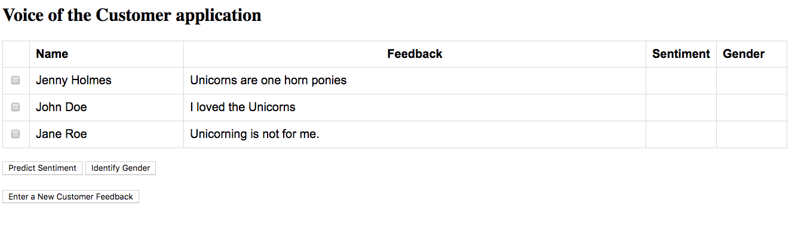

Note that at this point the controls for **Predict Sentiment** and **Identify Gender** does not work. This is so because you haven't added any method and integration to execute these functions.

Move on to [Sentiment Analysis](../2_SentimentAnalysis) module to learn how you can use the API driven services offered by Amazon Comprehend to predict the sentiments expressed in the feedbacks entered by the customers.

Move on to [NLP Classifier](../3_NLPClassifier) module to learn how you can use the Amazon SageMaker to orchestrate a Machine Learning pipeline to train, validate, host and deploy an LSTM based clssifier to identify users' gender from the name they have entered while submitting feedbacks.
